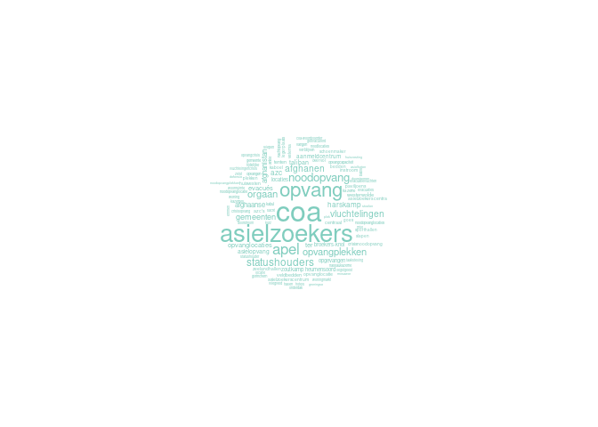
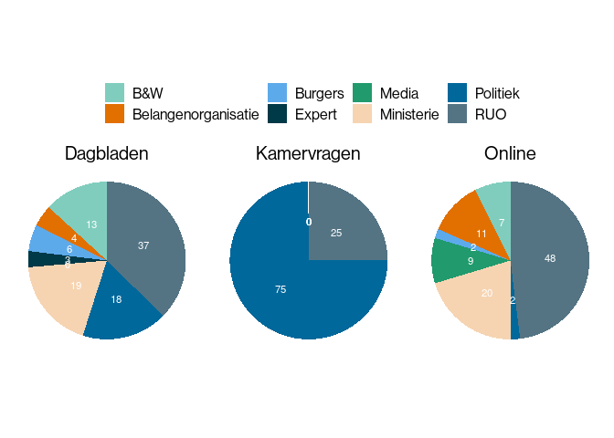

Nieuwsverhaal COA
================
Analyses inhoud van het nieuws
April 2022

# 1. Dynamiek nieuwsverhalen

In deze eerste analyse laten we zien in hoeverre het nieuwsverhaal rond
het COA eind 2021 in het nieuws is geweest. Het gaat hierbij om de
opvang van asielzoekers uit Afghanistan die na de inname van het land
door de Taliban zijn gevlucht.

In onderstaande figuur gewen we weer in hoeverre de berichtgeving is
verlopen. We zien rond de 0 op de x-as de dag waarop het meeste nieuws
is verschenen over dit nieuwsverhaal.

<!-- -->

# 2. Aantallen berichten per mediumtype

In onderstaande figuur zien we de aandacht voor het nieuwsverhaal in de
verschillende mediagroepen.

<!-- -->

We zien dat het meeste nieuws te vinden is in de dagbladen (43%) gevolgd
door de online nieuwssites (36%). De Televisieprogramma’s nemen een
aanzienlijk deel van de berichtgeving voor hun rekening (17%) terwijl de
Kamervragen 4% van de berichtgeving vertegenwoordigen.

# 3. Aandacht per mediumtype per week

In onderstaande figuur geven we weer hoe de verichtgeving verloopt per
week. In het midden (bij de 0 op de x-as) is de week waarin de meeste
berichgeving te vinden is over het nieuwsverhaal rond de opvang van de
vluchtelingen.

<!-- -->

We zien dat het nieuws vooral wordt gedomineerd door berichtgeving in de
dagbladen, maar dat in de weken voor de piek ook veel aandacht is op
televisie. In een groot aantal uitzendingen, zowel nieuws als
achtergronden en aan de talkshowstafels wordt er over het onderwerp
gesproken. Ook valt het op dat er steeds Kamervragen worden gesteld in
de eerste weken tot aan de piek. Daarna neemt het nieuws direct snel af
en is er nog een kleine opleving na een paar weken.

# 4. Aantal artikelen en lengte van artikelen per week rond piek

In onderstaande figuur geven we twee lijnen weer. Allereerst de mint
groene lijnen die het aantal artikelen weergeeft per week. De @ lijn
geeft het gemiddelde aantal woorden weer dat een artikel in die week
bevatte. Hierbij hebben we de televisie-uitzendingen achterwege gelaten.

<!-- -->

We zien dat naarmate de tijd vordert er meer artikelen per week worden
geschreven, maar de gemiddelde lengte van de artikelen gaat naar
beneden. Na de piek in de aandacht zie je het omgekeerde gebeuren. Er
worden minder artikelen geschreven, maar de gemiddelde lengte van de
artikelen neemt aanzienlijk toe.

# 5. Wordcloud

In onderstaande figuur geven we een wordcloud weer van de woorden die
het meest voorkomen in het nieuws over dit nieuwsverhaal.
<!-- -->

We zien dat het COA hier veruit het grootste is. Daarnaast gaat het
nieuws vooral over de (nood)opvang van asielzoekers, gaat het over de
vraag of er genoeg opvangplekken zijn. Worden statushouders genoemd en
ook gaat het over concrete plaatsten zoals Harskamp en Ter Apel, waar
vluchtelingen worden opgevangen.

# 6. Bronnen in het nieuws

In deze analyse gaan we in op de bronnen van het nieuws en kijken in
hoeverre deze voorkomen in het nieuws. We hebben hiervoor de computer
laten traceren wie er als bron in het nieuws naar voren komt. Deze
bronnen hebben wij ingedeeld in de volgende categorieen.

Rijksuitvoeringsorganisaties, Politiek, Ministerie, Expert, Media,
Belangenorganisatie, Burgers, B&W en Bedrijsleven.

In onderstaande figuur geven we weer in hoeverre deze groepen bronnen
naar voren komen in de berichtgeving.

<!-- -->

We zien dat de Rijksuitvoeringsorganisatie, in dit geval het COA, het
vaakst aan het woord wordt gelaten in de berichtgeving. Daarnaast hebben
de media veel ruimte voor de politiek als bron van het nieuws en het
ministerie. Ook komen burgemeesters en wethouders aan het woord, vooral
wanneer het gaat om de mogelijke opvang in een specifieke gemeente.

# 6a. Bronnen in het nieuws over tijd

In onderstaande figuur geven we weer in hoeverre de verschillende
bronnen voorkomen in het nieuwsverhaal rond het COA in aanloop naar de
week met het meeste nieuws en in de weken erna.

<!-- -->

We zien dat in het begin van dit nieuwsverhaal het voor het COA zelf is
dat in het nieuws verschijnt als bron. Daarna komen er ook meer politici
in het nieuws als bron en worden zij vaker of net zo vaak als bron
opgevoerd in het nieuws als de Rijksuitvoeringsorganisatie zelf. De week
waarin het meeste nieuws veschijnt zien we dat het vooral het ministerie
is dat aan het woord komt in het nieuws. De weken erna verdwijnen de
politici en het ministerie op de achtergrond en wordt het COA weer vaker
aan het woord gelaten.

# 7. Frames

Het verhaal rond het COA is vooral ondergravend; een meerderheid van de
frames valt in die categorie, zoals ook blijkt uit onderstaande figuur.

<!-- -->

De helft van de frames (50%) bestaat uit het frame ‘Geen grip’. Het COA
kon de stroom vluchtelingen niet aan was de strekking van het
nieuwsverhaal. Daarnaast is het frame ‘gedeelde verantwoordelijkheid’
groot, oftewel de problematiek is niet alleen het probleem van de RUO.
In dit geval betekende het dat in de berichtgeving ook aandacht was voor
de verschillende gemeenten die vluchtelingen wilden of moesten opvangen.

Het frame ‘Grenzen’ gaat erover dat de Rijksuitvoeringsorganisatie nu
eenmaal moet werken binnen de grenzen en mogelijkheden van de wet zoals
die door hen wordt uitgevoerd. Daarmee wordt ook vaak gewezen naar Den
Haag waar de beleidsmakers niet altijd oog hebben voor de uitvoering van
de wet. Ook waar het gaat om het frame ‘Kapot bezuinigd’ wordt Den Haag
veelal genoemd. In dit verhaal komt dit frame ook met regelmaat terug.
Juist de bezuiningen van de afgelopen jaren hebben de situatie
veroorzaakt.

# 7a. Frames over tijd

In onderstaande figuur geven we weer in hoeverre er constructieve en
ondergravende frames voorkwamen in het nieuws en in hoeverre het nieuws
neutraal was of zowel constructieve als ondergravende frames bevatte.
Daarnaast onderscheiden we nog een vierde categorie berichten, namelijk
die berichten waarin geen frame te vinden was. Dit zijn berichten waarin
vooral feiten worden weergegeven die verder niet in een bepaalde context
worden geplaatst.

<!-- -->

We zien dat in het begin van het nieuwsverhaal, de eerste dagen, nog
nieuws te vinden was waarin geen frames werden gebruikt. In het begin
van het nieuwsverhaal worden naast artikelen met ondergravende frames
ook artikelen teruggevonden waarin slechts feiten worden vermeld. De
weken erna domineert het nieuws waarin vooral ondergravende frames
worden gebruikt. Hier en daar zijn nog feitelijke artikelen te vinden,
maar berichten met constructieve frames zijn niet of nauwelijks terug te
vinden in het nieuws.
