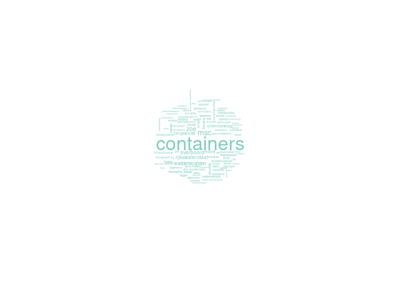

Nieuwsverhaal Rijkswaterstaat
================
Analyses inhoud van het nieuws
April 2022

# 1. Dynamiek nieuwsverhalen

In deze analyse laten we de aandacht zien voor het nieuwsverhaal rond
Rijkswaterstaat, wanneer de containers van het vrachtschip MSC Zoe
terecht komen in de Waddenzee. Dit gebeurt begin 2019 en duurt nog weken
erna omdat de berging van de containers moeizaam verloopt en er ook veel
spullen aanspoelen.

In onderstaande figuur gewen we weer in hoeverre de berichtgeving is
verlopen. We zien rond de 0 op de x-as de dag waarop het meeste nieuws
is verschenen over dit nieuwsverhaal.

<!-- -->

Hier is duidelijk te zien dat dit een nieuwsverhaal is dat eigenlijk
begint bij de piek in aandacht. De meeste artikelen verschijnen binnen
enkele dagen en daarna komt het verhaal steeds terug doordat er
ontwikkelingen te melden zijn.

# 2. Aantallen berichten per mediumtype

In onderstaande figuur zien we de aandacht voor het nieuwsverhaal in de
verschillende mediagroepen.

<!-- -->

We zien dat het meeste nieuws te vinden is op de online nieuwssites
(59%) gevolgd door de dagbladen (30%). De Televisieprogramma’s nemen een
klein deel van de berichtgeving voor hun rekening (8%) en de Kamervragen
vertegenwoordigen 3% van het nieuws.

# 3. Aandacht per mediumtype per week

In onderstaande figuur geven we weer hoe de verichtgeving verloopt per
week. In het midden (bij de 0 op de x-as) is de week waarin de meeste
berichgeving te vinden is over het nieuwsverhaal rond containers die in
zee zijn gevallen.

<!-- -->

We zien dat het nieuws vooral wordt gedomineerd door berichtgeving op de
online sites en dit blijft de gehele periode het geval. Er is in de
dagbladen een aantal weken aandacht voor het verhaal waarna er steeds
minder aandacht voor is. Ook op Televisie, met name in het nieuws, is er
steeds aandacht voor het verhaal en in de Kamer worden op verschillende
momenten vragen gesteld.

# 4. Aantal artikelen en lengte van artikelen per week rond piek

In onderstaande figuur geven we twee lijnen weer. Allereerst de mint
groene lijnen die het aantal artikelen weergeeft per week. De oranje
lijn geeft het gemiddelde aantal woorden weer dat een artikel in die
week bevatte. Hierbij hebben we de televisie-uitzendingen achterwege
gelaten.

<!-- -->

We zien dat tijdens de piek van de aandacht de artikelen minder lang
zijn geworden. Er wordt door veel media geschreven over de containers,
maar dat zijn vooral korte berichten. Naarmate de tijd vordert komen er
minder artikelen in het nieuws, maar die zijn wel aanzienlijk langer.
Het gaat dan vooral om terugblikken en analyses.

# 5. Wordcloud

In onderstaande figuur geven we een wordcloud weer van de woorden die
het meest voorkomen in het nieuws over dit nieuwsverhaal.
<!-- -->

We zien dat het woord containers prominent voorkomt in al het nieuws.
Net als de woorden overboord en de naam van de boot Zoe. Ook de
Waddenzee komt regelmatig terug in het nieuws.

# 6. Bronnen in het nieuws

In deze analyse gaan we in op de bronnen van het nieuws en kijken in
hoeverre deze voorkomen in het nieuws. We hebben hiervoor de computer
laten traceren wie er als bron in het nieuws naar voren komt. Deze
bronnen hebben wij ingedeeld in de volgende categorieen.

Rijksuitvoeringsorganisaties, Politiek, Ministerie, Expert, Media,
Belangenorganisatie, Burgers, B&W en Bedrijsleven.

In onderstaande figuur geven we weer in hoeverre deze groepen bronnen
naar voren komen in de berichtgeving.

<!-- -->

We zien dat de Rijksuitvoeringsorganisatie, in dit geval
Rijkswaterstaat, het vaakst aan het woord wordt gelaten in de
berichtgeving. Daarnaast hebben de media veel ruimte voor experts als
bron van het nieuws en worden ook belangenorganisaties veelvuldig aan
het woord gelaten. Het ministerie en de politici komen in beperkte mate
aan het woord.

# 6a. Bronnen in het nieuws per type media

In onderstaande figuur geven we weer in hoeverre de verschillende
bronnen naar voren kwamen in het nieuws van de dagbladen, de online
nieuwssites en in de Kamervragen.

<!-- -->

We zien dat de Rijksuitvoeringsorganisatie iets vaker in het nieuws als
bron naar voren kwam in dagbladen dan in de artikelen op de nieuwssites
en in de Kamervragen. Experts en belangenorganisaties komen nagenoeg
even vaak als bron van het nieuws terug in dagbladen en op de
nieuwssites. Online nieuwssites citeren wel vaker andere media.

# 6b. Bronnen in het nieuws over tijd

In onderstaande figuur geven we weer in hoeverre de verschillende
bronnen voorkomen in het nieuwsverhaal rond Rijkswaterstaat in aanloop
naar de week met het meeste nieuws en in de weken erna.

<!-- -->

We zien dat in het begin van dit nieuwsverhaal het vooral
Rijkswaterstaat is dat in het nieuws verschijnt als bron. Daarna komt
het ministerie meer aan het woord en ik ser ook ruimte voor politici en
experts. Tijdens de piek in de aandacht wordt vooral het ministerie aan
het worod gelaten en erna is het weer vooral Rijkswaterstaat.

# 7. Frames

Het verhaal rond Rijkswaterstaat vooral constructief een meerderheid van
de frames valt in die categorie, zoals ook blijkt uit onderstaande
figuur.

<!-- -->

Veruit het meest gebruikte frame is het Plichtsbesef frame. Oftewel
Rijkswaterstaat doet waarvoor het op aarde is. Daarnaast wordt het frame
dat Rijkswaterstaat beschrijft als kritische tegenlezer regelmatig
gebruikt. In dit geval betekent dit dat Rijkswaterstaat waarschuwt voor
de problemen die zijn ontstaan door de containers en wat we hier in de
toekomst tegen kunnen doen.

# 7a. Frames in de verschillende type media

In onderstaande figuur geven we het gebruik van de frames weer in de
verschillende soorten media.

<!-- -->

In de Kamervragen wordt slechts het Kritisch tegenlezer frame gebruikt.
In de overige media is het plichtsframe dominant. Het sterkst in de
berichtgeving online. De kritische tegenlezer is op televisie
aanzienlijk minder gebruikt dan in de andere media, terwijl in de
dagbladen het vlinder effect frame ook terug te vinden is. Hierbij gaat
het erom dat er door een kleine fout een keten van fouten in werking
gezet kan worden die kunnen leiden tot een ramp.

# 7b. Frames over tijd

In onderstaande figuur geven we weer in hoeverre er constructieve en
ondergravende frames voorkwamen in het nieuws en in hoeverre het nieuws
neutraal was of zowel constructieve als ondergravende frames bevatte.
Daarnaast onderscheiden we nog een vierde categorie berichten, namelijk
die berichten waarin geen frame te vinden was. Dit zijn berichten waarin
vooral feiten worden weergegeven die verder niet in een bepaalde context
worden geplaatst.

<!-- -->

We zien dat het patroon eenzijdig is, het constructieve frame domineert
de gehele periode. Heel af en toe zijn er artikelen te zien die niet
geframed zijn of waar ook een ondergravend frame wordt genoemd, maar die
zijn zeldzaam.
