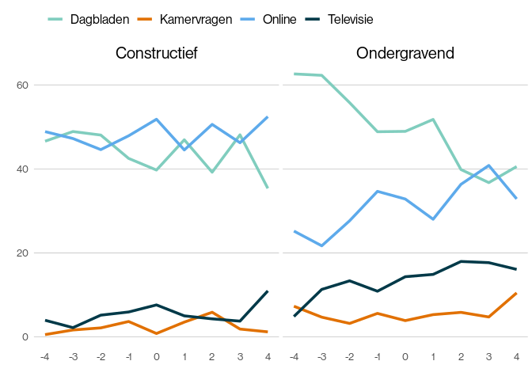

# Rijksuitvoeringsorganisaties in het nieuws

<!-- -->

-   38 Rijksuitvoeringsorganisaties
-   Dagbladen, online nieuwssites, Kamervragen, ondertiteling
-   Totaal 127.816 items / artikelen

Methode: - Iteratief proces van automatische en handmatige
inhoudsanalyse - Kwalitatief en Kwantitatief

# Nieuwsverhalen: COA

<!-- -->

# Nieuwsverhalen: Rijkswaterstaat

<!-- -->

- In totaal 79 nieuwsverhalen in 21 Rijksuitvoeringsorganisaties
- 7.343 artikelen in totaal
- 3.181 gecodeerde artikelen; 38 nieuwsverhalen

# Gevonden frames

# Gecodeerde nieuwsverhalen

<!-- -->

-   38 nieuwsverhalen
-   20 verschilldende RUOs
-   (Kadaster wel gecodeerd maar geen frames)

# Twee soorten organisaties:

**Ondergravend:** dit zijn Rijksuitvoeringsorganisaties waar het
meerdendeel van de frames vallen in de categorie ondergravend. Het gaat
hier om de Belastingdienst, CBR, COA, DJI,IND, NVWA, RIVM en het UWV

**Constructief:** dit zijn Rijksuitvoeringsorganisaties waar de
constructieve frames het vaakst voorkomt. Het gaat hier om: ACM, IGJ,
ILT,KNMI, KvK, Marechaussee, NFI, Rijkswaterstaat, SVB, Staatsbosbeheer,
Politie en OM.

# RUOs & soort media

<!-- -->

**Conclusie 1:** ander mediabeeld, meer dagbladen,meer TV en meer
Kamervragen bij ondergravende nieuwsverhalen

# Dynamiek tussen media per soort nieuwsverhaal

<!-- -->

**Conclusie 2:** Dagbladen jagen ondergravende nieuwsverhalen aan,
waarna TV belangrijke rol vult

# Aantal artikelen en lengte van artikelen

<!-- -->

**Conclusie 3:** Veel lange artikelen aan het begin van een ondergravend
nieuwsverhaal, waarna alle media erop springen maar artikelen korter
zijn en daarna neemt lengte toe ivm nabeschouwingen

# Bronnen in het nieuws

<!-- -->

**Conclusie 4**: Ander brongebruik per soort nieuwsverhaal.
Ondergravende nieuwsverhalen citeren veel meer politieke actoren,
terwijl RUOs en Experts vaker woren geciteerd bij constructieve
nieuwsverhalen.

# Bronnen per mediumtype

<!-- -->

**Conclusie 5:** RUOs vaker als bron in Online nieuws dan in dagbladen.
Politiek vaker bron in dagbladen dan bij online sites. Ministerie even
vaak. Experts vaker bij dagbladen als bron, andere media vaker bron bij
online nieuwssites.

# Dynamiek van bronnen in nieuwsverhalen

<!-- -->

**Conclusie 6:** Andere dynamiek van de bronnen. Bij ondergravende
nieuwsverhalen hebben RUOs in het begin nog enige zeggenschap maar neemt
politiek het al snel over. Bij constructieve nieuwsverhalen zijn alleen
tijdens de piek politieke bronnen dominant

# Frames in het nieuws

<!-- -->

**Conclusie 7:** Iets meer ongeframede en neutraal geframede
berichtgeving bij ondergravende nieuwsverhalen.

# Frames & Type media

<!-- -->

**Conclusie 8:** Ander patroon soorten frames per type media. Minst
ondergravend en meest constructief in Online media. Meest ondergravend
en minst constructief in de Kamervragen. Meest neutrale berichtgeving in
dagbladen. Meest ongeframede berichtgeving in dagbladen en online media.

# Dynamiek van de frames in Nieuwsverhalen

<!-- -->

**Conclusie 9:** Andere dynamiek in de frames Bij ondergravende
nieuwsverhalen in het begin nog ongeframede berichten, maar dat neemt
snel af tot na de piek. Daarna ook meer ruimte voor constructieve
frames.
